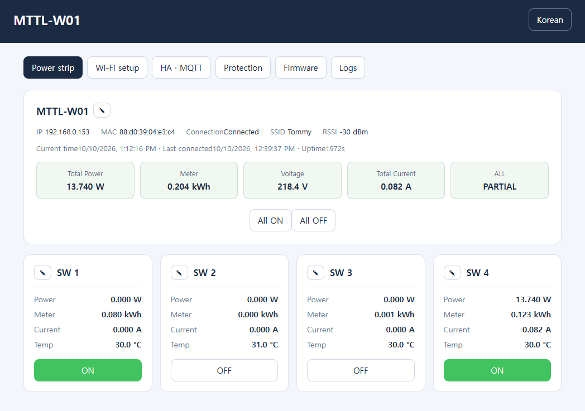

# MTTL-W01 Standalone Firmware

한국어 | [English](README_EN.md)

LG U+ MTTL-W01을 별도 백엔드 서버나 DNAT 없이 Wi-Fi 웹 대시보드와
MQTT로 Home Assistant에 연결하는 독립 펌웨어입니다.

## 다운로드

**2.0.9 / build `4ccbc26ad84a803d` · 2026-10-10**

[comMTTL-W01_2.0.9.fwr 다운로드](firmware/comMTTL-W01_2.0.9.fwr)

SHA-256: `30f2816cce89d7503759c4e630b1e6247ca10066a96a892b2524624e5d971d1e`

기존 독립 펌웨어 사용자는 기기 웹의 **펌웨어** 탭에서 위 파일로 업데이트할 수 있습니다.

모든 하드웨어 변형에 대한 호환성을 보증하지 않습니다. 설치 실패 시
디버거를 이용한 복구가 필요할 수 있습니다. 소프트웨어 보호는 하드웨어 안전 보호 장치를 대체하지 않습니다.
테스트 기기에서 1000W 제한과 드라이어 부하로 고전력 차단을 확인했습니다. 전류·온도 차단과 계측 정확성은 별도 실기 검증 전입니다.

## 기능

- 고온·전체 전류·전체 전력 보호 설정 및 전체 OFF 차단

- SoftAP Wi-Fi 설정, SSID 검색, LAN에서 Wi-Fi 변경 및 자동 재연결
- 개별 채널·전체 ON/OFF, 물리 버튼과 LED 연동
- 전체 전력·누적량·전압·전류와 채널별 전력·누적량·전류·온도
- 기기명·채널명 변경, 한국어/영어 UI, NTP 시간, 브라우저 세션 로그
- Home Assistant MQTT Discovery: 스위치 5개·센서 20개
- SSE 상태 반영, 웹 optimistic 제어; HA는 완료 상태 보고 사용
- FWR 웹 OTA, 설정·누적량 유지, watchdog 활성화
- 순정 1.0.66·로컬 패치 1.0.68 FWR 복구
- 물리 메인 버튼 10초 길게 누르기로 Wi-Fi 설정 모드 진입 시 전체·채널별 누적 전력량 초기화

센서는 약 10초 주기로 갱신합니다. 채널 전류는 0.019A를 차감하고 음수는
0으로 표시합니다. 채널 상태는 실제 접점 측정이 아닌 논리 상태입니다.
마지막 제어 완료 후 10초 뒤 저장하므로, 그 전에 전원을 끄면 이전 상태가 표시될 수 있습니다.

## 준비물

- MTTL-W01, 2.4GHz Wi-Fi (open 또는 WPA2 Personal)
- 최초 설치용 Wi-Fi 기능이 있는 Windows x64 PC 또는 Apple silicon Mac
- HA 연동 시 MQTT 브로커와 Home Assistant MQTT 통합

## 최초 설치: Windows / macOS OTA 도구

[ttaengz님의 OTA 도구](https://github.com/ttaengz/mttl-w01-matterbridge#펌웨어-업데이트)를
사용합니다. **Wi-Fi 설정 도구가 아니라 OTA 도구**를 내려받으십시오.
도구 및 운영체제별 지원 범위는 해당 저장소 안내를 따릅니다.

1. 이 저장소의 `comMTTL-W01_2.0.8.fwr`와 운영체제에 맞는 OTA 도구를 준비합니다.
2. 순정 멀티탭의 메인 버튼을 10초 이상 눌러 설정 모드로 전환합니다.
3. PC에서 `TONLY_TAP_xxxxxxx` Wi-Fi에 연결합니다. 암호는
   `LGU_xxxxxxx`이며 뒤의 문자열은 해당 AP 이름과 동일하게 입력합니다.
4. OTA 도구에서 내려받은 **이 저장소의 FWR**을 선택하고 도구 안내에 따라 전송합니다.
   MatterBridge 서버 설치나 해당 프로젝트의 펌웨어는 필요하지 않습니다.
5. 전송 중 전원을 차단하지 않습니다. 재부팅 후 독립 펌웨어의
   `MTTL-W01-SETUP` AP가 나타나는지 확인합니다.

## Wi-Fi 설정

1. 비밀번호 없는 `MTTL-W01-SETUP` AP에 연결하고 `http://192.168.4.1`을 엽니다.
2. Wi-Fi 탭에서 SSID 검색 → 선택 → 암호 입력 → 연결을 실행합니다.
3. 공유기에서 할당 IP를 확인하여 `http://기기IP`에 접속합니다.

이미 설정된 기기는 메인 버튼을 10초 이상 눌러 SoftAP에 진입할 수 있습니다.
일반 LAN에서도 Wi-Fi 변경이 가능하며, 변경 후 새 네트워크의 IP를 확인해야 합니다.
공유기 연결이 끊기면 저장된 Wi-Fi로 재시도합니다. 직접 연 설정 모드는 유지합니다.

## Home Assistant

1. HA에서 MQTT 통합을 준비합니다.
2. 기기 웹의 MQTT 탭에서 브로커 주소·포트·사용자·암호를 입력합니다.
3. MQTT를 활성화하고 저장하면 HA에 기기와 엔티티가 자동 등록됩니다.

2.0.7부터 MQTT를 비활성화하고 저장하면 HA Discovery 등록을 삭제합니다.
브로커에 연결할 수 없으면 연결 복구 후 삭제를 재시도하며, 다시 활성화하면 재등록됩니다.
삭제를 위해 기존 등록이 남아 있는 브로커 주소·인증 정보는 유지하십시오.

Discovery 접두사는 `homeassistant`이며 ID는
`switch.mttl_<MAC 마지막 7자리>_sw1` 형태입니다. 전체 스위치는 `_all`입니다.
HA가 기존 ID와의 충돌로 접미사를 추가할 수 있습니다.

## 이후 업데이트: 기기 웹 OTA

1. 최신 독립 `.fwr`을 내려받습니다.
2. 기기 웹의 **펌웨어** 탭에서 파일을 선택하여 업로드합니다.
3. 전원을 유지하고 자동 재부팅 후 버전과 빌드를 확인합니다.

BIN·전체 플래시 덤프는 독립 웹 OTA에 올리지 마십시오.
수동 SHA-256이나 토큰 입력은 필요 없습니다. 내부 이미지·슬롯 검사는 유지합니다.
전송이 끊기면 기기 웹 탭을 모두 닫고 현재 빌드를 확인한 뒤 재시도하십시오.

## 순정 / 로컬 펌웨어로 복구

순정 `1.0.66` FWR은 [기존 저장소의 순정 펌웨어 경로](https://github.com/af950833/mttl_w01/tree/main/work/firmware/1.0.66)에서 받을 수 있습니다.

**2.0.5 이상**의 펌웨어 탭에서 순정 `1.0.66` 또는 기존 백엔드용 로컬 패치
`1.0.68` FWR을 선택하여 업로드합니다. 전송·재부팅 중 전원을 유지하십시오.
다른 버전이나 임의 형식의 파일은 지원하지 않습니다.

- 복구 후 독립 웹 대시보드와 직접 HA MQTT 연동은 종료됩니다.
- 순정은 기존 프로비저닝·서비스 연결을 다시 설정해야 할 수 있습니다.
- 로컬 1.0.68은 사용할 백엔드 IP로 생성한 파일과 해당 백엔드 서버가 필요합니다.
- HA에 남은 독립 펌웨어 엔티티는 필요에 따라 직접 정리하십시오.
- 독립 펌웨어로 돌아오려면 위의 **최초 설치 OTA 도구**를 다시 사용합니다.

고정 파일 SHA-256 지문 목록은 사용하지 않지만, 이미지 형식·크기·체크섬과
수신 데이터/플래시 읽기의 SHA-256 일치 여부 및 슬롯 호환성을 검사합니다.
이는 파일 서명 인증이 아니므로 신뢰할 수 있는 출처의 FWR만 사용하십시오.
복구 경로는 ARM 실행·모의 플래시 시험 142개를 통과했으며,
실제 기기에서의 1.0.66·1.0.68 복구 부팅은 아직 별도 확인이 필요합니다.

## 검증 및 보안

테스트 기기에서 반복 웹 OTA, 설정·채널 상태 유지, Wi-Fi 변경, MQTT 브로커
재시작 및 공유기 재부팅 후 재연결을 확인했습니다. watchdog의 실제 멈춤 복구,
모든 기기 변형, 계측 정확성 및 장기 안정성은 미검증입니다.

신뢰할 수 있는 내부망 전용입니다. HTTP/MQTT는 암호화되지 않으며 웹 로그인,
OTA 토큰·서명 인증이 없습니다. 인터넷에 포트를 노출하지 마십시오.
Origin 검사는 사용자 인증이 아닙니다.

현재 저장소는 펌웨어와 설치 안내를 배포하며, 전체 빌드용 SDK 소스는 아직 포함하지 않습니다.

## 보호 설정

| 항목 | 조정 범위 | 최초 기본값 | 차단 조건 |
| --- | --- | --- | --- |
| 고온 | 50–90 °C | 활성화, 90 °C | 채널 중 하나라도 첫 초과 |
| 전체 전류 | 1–16 A | 활성화, 16 A | 보정 후 합계가 2회 연속 초과 |
| 전체 전력 | 100–3000 W | 활성화, 3000 W | 전체 전력이 2회 연속 초과 |

값을 조정한 뒤 **적용**을 누르면 재부팅·OTA 후에도 유지됩니다. 기존 버전에서 처음 업데이트하면 위 기본값으로 활성화됩니다.
채널별 순차 측정으로 전체 측정 주기는 약 10초이며 연속 감시는 아닙니다. 설정값과 같으면 차단하지 않습니다.
센서 읽기 실패는 오류만 표시하고 해당 연속 초과 횟수를 초기화합니다. 전력 계산은 기존 방식 그대로입니다.
차단 후 잠금이나 자동 재켜기는 없으며, 사용자가 다시 ON해도 조건을 초과하면 다시 차단합니다.
2.0.8의 새 설정 형식은 2.0.7 이하에서 읽을 수 없으므로, 이전 독립 버전으로 내리면 설정이 유지되지 않을 수 있습니다.

## 누적 전력량 초기화

**2.0.9 이상에서 물리 메인 버튼을 10초 이상 길게 눌러 SoftAP 설정 모드로 진입하면 전체 및 4개 채널의 누적 전력량이 0으로 초기화됩니다. Wi-Fi만 변경하려는 경우에도 이 동작은 누적량을 초기화하므로 주의하십시오.**

현재 계측 카운터를 새 기준점으로 삼아 이후 증가분만 누적하며, 초기화 값은 즉시 플래시에 저장하여 재부팅 후에도 유지합니다. 릴레이 상태, Wi-Fi·MQTT·보호 설정과 기기·채널 이름은 유지됩니다. 일반 재부팅이나 자동 SoftAP 진입에서는 초기화하지 않습니다.

한 번 길게 누르면 한 번만 초기화합니다. 정상 채널 카운터 확보와 저장 성공 후 설정 모드로 진입하므로 센서·저장 오류 시 진입이 지연될 수 있습니다. 저장에 실패하면 기존 누적값을 유지합니다.

## Version History

### 2.0.9 — 2026-10-10

- 물리 메인 버튼을 10초 이상 길게 눌러 SoftAP 진입 시 전체·채널별 누적 전력량 초기화
- 현재 계측 카운터로 기준점을 재설정하고 초기화 값을 즉시 플래시에 저장; 이후 증가분만 누적
- 릴레이 상태와 다른 설정 유지; 일반 재부팅·자동 SoftAP 진입에서는 초기화하지 않음
- 저장 실패 시 기존 누적값 유지, 한 번의 길게 누르기에 중복 초기화 방지
- 웹 자산 gzip 압축 개선으로 기존 힙·스택 예약 용량 유지
- 초기화·저장·재부팅 복원 오프라인 검증 및 OTA 모의 검증 142개 통과; 테스트 기기에서 초기화 정상 동작 확인

### 2.0.8 — 2026-10-10

- 보호 설정 탭 추가: 고온·전체 전류·전체 전력의 차단값을 슬라이더로 조정하고 각 항목의 활성화 여부를 독립적으로 설정
- 적용한 설정을 플래시에 저장하여 재부팅·OTA 후 유지; 기존 설정·누적 전력량·릴레이 논리 상태를 보존하여 마이그레이션
- 고온은 채널 중 하나라도 첫 초과 시 전체 OFF, 전체 전류·전력은 새 측정값이 2회 연속 초과하면 전체 OFF
- 전류 보호는 채널별 0.019A를 차감하고 음수를 0으로 제한한 값의 합계 사용; 기존 전력 변환 방식 유지
- 센서 읽기 실패는 오류만 표시하고 해당 연속 초과 횟수를 초기화; 차단 후 잠금이나 자동 재켜기 없음
- 슬라이더 오른쪽에 조정값·단위를 실시간 표시하고 숫자 영역이 밀리지 않도록 배치
- 테스트 기기에서 1000W 제한의 고전력 차단 실기 확인; 온도·전류 차단은 별도 검증 전

### 2.0.7 — 2026-10-09

- MQTT 해제 시 스위치 5개·센서 20개의 HA Discovery 등록 및 retained availability 삭제
- 삭제 전송 후 브로커 응답 확인, 연결 실패 시 재시도 및 재활성화 시 재등록
- 켜진 채널의 웹 ON 버튼을 녹색 배경·흰색 글씨로 표시하고 OFF는 기존 스타일 유지

### 2.0.6 — 2026-10-08

- 전체·채널 스위치 상태 발행에 `retain=true`를 적용하여 HA가 나중에 연결해도 마지막 보고 상태 수신
- HA 재연결 시 변경되지 않은 채널 상태도 재발행
- 계측 센서는 기존처럼 `retain=false` 및 실시간 발행·만료 처리 유지
- 테스트 기기에서 2.0.6 OTA·재부팅·MQTT 재연결 및 채널 상태 유지 확인

### 2.0.5 — 2026-10-08

- 릴레이 출력·해제 경로 최적화로 연속 채널 및 전체 ON/OFF 응답 속도 개선
- 웹 펌웨어 페이지에서 순정 1.0.66·로컬 패치 1.0.68 FWR 복구 지원
- 고정 복구 파일 지문 제한 없이 이미지 형식·체크섬·플래시 읽기 검증 유지

### 2.0.0 — 2026-10-07

- 독립 펌웨어 최초 공개
- SoftAP/LAN Wi-Fi 설정 및 자동 재연결
- 개별·전체 릴레이 제어, 물리 버튼·LED 연동 및 채널 상태 저장
- 전체·채널별 센서 표시와 Home Assistant MQTT Discovery 연동
- 한국어·영어 웹 대시보드, SSE 상태 반영 및 FWR 웹 OTA
- 설정·누적 전력량 유지 및 watchdog 적용
